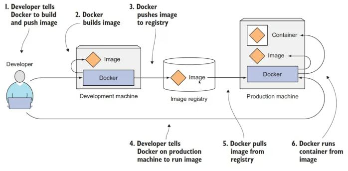

### Docker Architecture

### Docker Components
- ***Docker daemon*** - слушает API запросы от клиента и управляет объектами, такими как images, containers, volumes, networks. 
- ***Docker client (docker)*** - тула для общения с докер демоном (ей также может быть jenkins plugin, например. 
- ***Docker images*** - read-only темплейт с инструкциями для создания докер контейнера. Имейдж модет быть основан на другом имэйдже с какими-то кастомизациями. 
- ***Docker containers*** - запущенный экземпляр имэйджа. Можно создавать, удалять, запускать или останавливать их. 
- ***Docker registry*** - хранит докер имейджи. 
- ***Docker proxy*** - процесс, ответственный за биндинг портов контейнера на порты хоста. 
- ***Docker service*** - сущность из swarm. Позволяет масштабировать контейнеры через множественные докер демоны. 

### Технологии изоляции
 ****Namespaces****
 
При запуске контейнера докер создает набор нэймспейсов для него. Это обеспечивает изоляцию. Каждый аспект контейнера работает в своем неймспейсе и к нему нет доступа из-вне. 
Некоторые неймспейсы: 
- ***pid*** namespace - process isolation (PID - process id)
- ***net*** namespace - managing network interfaces
- ***ipc*** namespace - managing access to IPC resources (InterProcess Communication)
- ***mnt*** namespace - managing mount-points
- ***uts*** namespace - isolation kernel and version identifiers (UTS: Unix Timesharing System)

 ****Control groups****
Фича ядра Linux, которая позволяет ограничивать, изолировать ресурсы (network, block i/o, CPU, Memory) для определенных процессов. Т.е. это группа процессов, объединенная по какому-то критерию и ограниченная лимитами

 ****Chroot****
 Изоляция на уровне файловой системы.
 
### Файловые системы

Если контейнер использует существующий файл только для чтения, то использейтся существующий слой, если же какой-то файл изменяется,  
то этот файл копируется на новый слой и модифицируется (copy-on-write (CoW) strategy).

#### Docker graphdrivers
- ***VFS*** - не использует UnionFS и CoW. Просто берутся слои и копируются в общую папку и там происходит вся жизнь контейнера. Не production решение.
- ***AUFS*** - уже начинает устаревать. Доступна только для Debian и Ubuntu. Не рассматривается как мэйнстрим решение.
- ***Overlay2*** - Используется по дефолту. Наилучшее решение.
- ***Device Mapper*** - Показывает неплохую производительность, если подтюнить, но зависит от низлежащих файловых систем (работает на уровне блочных девайсов).
- ***Btrfs*** - Показывает неплохую производительность, имеет функциональность снэпшотов, но зависит от низлежащих файловых систем (работает на файловой системе btrfs). Не поддерживается RedHatом.

### Docker workflow

